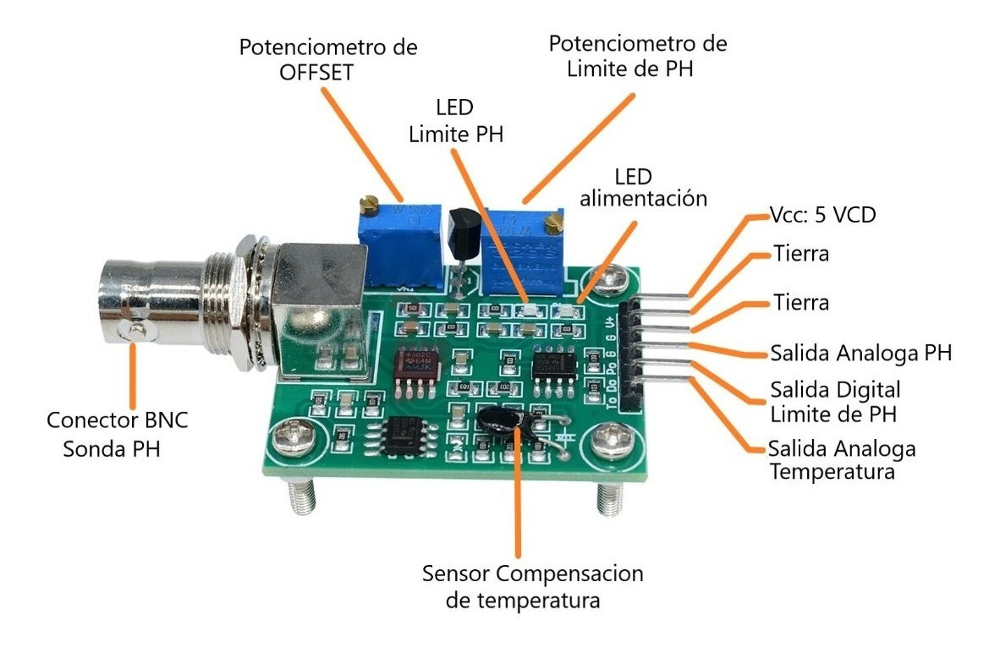
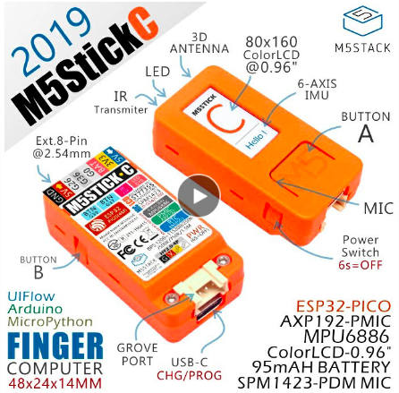
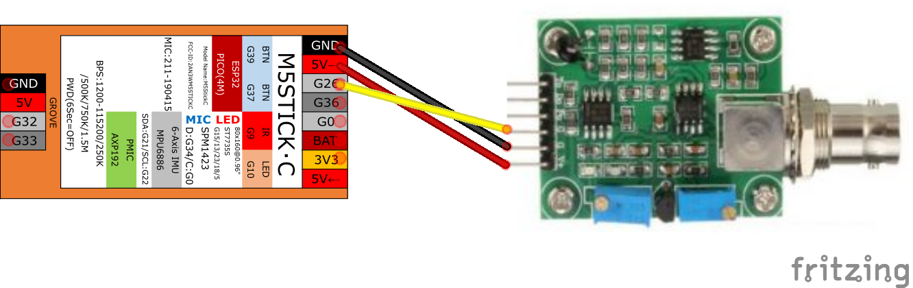

# pH sensor for water based solution based on ph-4502c and ESP32 microprocessor 

## The problem
My aquarium always has water turbidity problems.

## Deployed idea

The approach is easy. We have a sensor that send an analog signal that we have to read. Most of the microcontrollers that exist have at least, one analog digital conversion input AD. I have chosen the compact M5StickC model based on ESP32 that incorporates a perfect LCD screen for this use case.

## Things used in this project
**Hardware components**

- [M5StickC ESP32 PICO Mini IoT Development Board Finger Computer with Color LCD Built in Battery MPU...](https://www.aliexpress.com/item/32985247364.html) ×	1	 

- [PH-4502C Liquid PH Value Detection detect Sensor Module Monitoring Control Board For Arduino BNC Electrode Probe](https://www.aliexpress.com/item/32957428276.html) ×	1	

- Jumper Wires / DuPont Wires
- Voltage Tester

**Software apps and online services**
- [Arduino IDE](https://www.hackster.io/arduino/products/arduino-ide?ref=project-8e87cc)
- [Eclipse Mosquitto open source MQTT broker](https://mosquitto.org/)
- [Node-RED](https://nodered.org/)

## How does it Work?
The device is intended to be used as a portable tool. When the M5StickC is turned on, its display shows a continuous reading. If we press the M5 button, the last measurement will be sent in an MQTT package to the server that we have configured in the config.h file.

A Node-red application collects the package and displays the graph in an component of the dashboard that I have developed for the control of the smart aquarium filter.

## Development
I have used prototyping material. What is working is proof of concept for the use case of the system control of my aquarium of turtles.

**Schematics**
 

## References
* Based on [Wiring The pH (Power of Hydrogen) Ion Concentration Sensor with BNC Electrode Probe](https://www.14core.com/wiring-the-ph-power-hydrogen-sensor-bnc-electrode-probe-with-microcontroller/)
* [ph-4502c ph meter calibration notes](https://tlfong01.blog/2019/04/26/ph-4502c-ph-meter-calibration-notes/)
